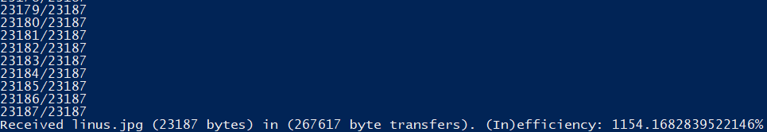

# bogodownload


Applying the stupidity of bogosort to file transfers is the height of folly.

### What is it?
Bogosort is the sorting method that constantly permutates an array until the result is sorted.

What would happen, then, if you applied those principles to file transfer? Bogodownload attempts to answer that question.

### But what is it though?

Bogodownload is a file transfer system using websockets, currently implemented in Python.

The server uses `Quart` and the client uses `aiohttp` and `websockets`.

When the client requests a file from the server via a websocket connection, data will be returned as such:

```json
{"size":1024, "pos":512, "byte":32}
```

The `size` parameter denotes the amount of bytes in the file, while the `byte` returned will correspond to its `pos`ition in the file, and will be random for each message. The server will continuously send these json messages through the websocket until the client cuts off the connection, usually when it has finished downloading the entire file.



### But why though?

I needed something to do after I finished making [JSON-G](https://github.com/Roadcrosser/JSON-G) okay? Get off my back.